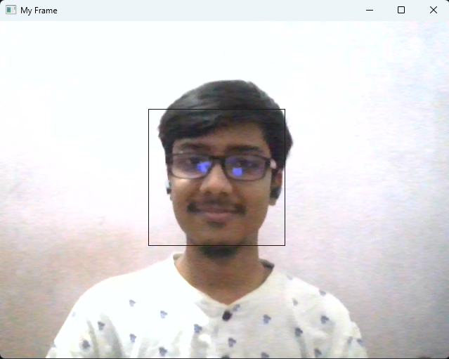

# Real-Time Face Detection

## Description
This project implements real-time face detection using Python and OpenCV. It captures video from your webcam and identifies faces in real-time.

## Features
- Real-time face detection.
- Drawing bounding boxes around detected faces.
- Displaying the frame rate in the console.

## Usage
1. **Prerequisites**: You need to have Python and OpenCV installed on your system. You can install them using `pip`:

    ```bash
    pip install opencv-python
    ```

2. **Clone the Repository**: Clone this repository to your local machine using the following command:

   ```bash
   git clone https://github.com/ZeusSama0001/real-time-face-detection.git

3. **Run the Script**: Execute the Python script to start real-time face detection:

   ```bash
   python Face_Capture.py
   ```
4. **Controls**:
   - Press q to exit the application.

## Screenshot
A screenshot showcasing the project's functionality:



## Author
Vaibhav Srivastava

GitHub: [ZeusSama0001](https://github.com/ZeusSama0001)

## License
This project is licensed under the MIT License - see the [LICENSE.txt](LICENSE.txt) file for details.
